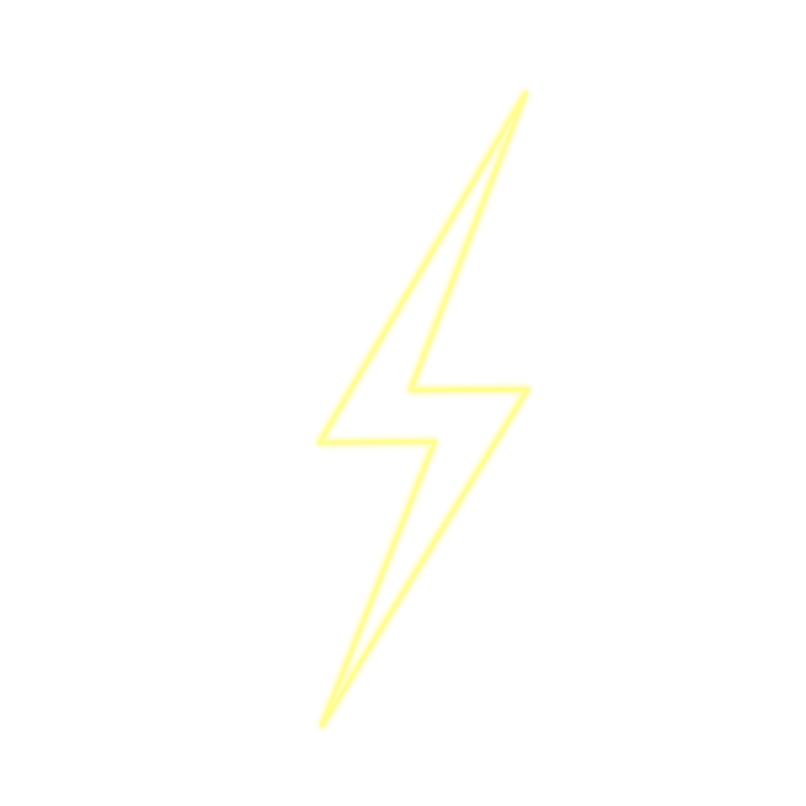

  &nbsp;&nbsp;
  &nbsp;&nbsp;
<!--    -->

## Hello World!  

I'm Steven Robledo, <!-- [Steven Robledo](https://stevennrobledo.com)--> a 5th year systems engineering and telecommunications student in Colombia . I do content on desktop and web development, , and in WordPress. I also enjoy UI, UX, and design in general. I'm a **learning enthusiast**  who is **obsessed** with the idea of **improving himself** and wants a **platform** to **grow**  and **excel.** 

 

**More about me:**

<!-- -  Visit my portfolio website at [stevennrobledo.com](https://stevennrobledo.com) -->
-  I’m currently learning to become a full stack and MERN stack developer
-  I’m looking forward to learn machine learning and computer vision
-  I’m pursuing a Bachelor's degree in systems engineering and telecommunications
-  Fun fact: I devote myself to deliver quality work with great passion.

## Skills & Experience&nbsp;

 
<table>
<thead> 
      <tr>
      <th>Fundamentals</th>
      <th>Frontend</th>
      <th>Backend</th>
      <th>Deployment</th>
    </tr>
</thead>
<tbody>
  
<tr>
<!--   <td align="center">
    <b>
C++
</b> 
     
  </td> -->
  
  <td align="center">
    <b>
Git
</b> 
     
  </td>

  <td align="center">
    <b>
React
</b> 
      
  </td>

  <td align="center">
    <b>
NodeJS
</b> 
     
  </td>

  <td align="center">
    <b>
Docker
</b> 
     
  </td>   
</tr>
  
  
<tr>

  <td align="center">
    <b>
Java
</b> 
     
  </td>
  
  <td align="center">
    <b>
Typescript
</b> 
     
  </td>
  
  <td align="center">
    <b>
MySQL
</b> 
     
  </td>
  
  <td align="center">
    <b>
Kubernetes
</b> 
     
  </td>
  
</tr>
  
<tr>

  <td align="center">
     <b>
PHP
</b> 
      
  </td>

  <td align="center">
    <b>
Bootstrap
</b> 
     
  </td>
  
  <td align="center">
    <b>
PostgreSQL
</b> 
     
  </td>
  
  <td align="center">
    <b>
Github
</b> 
     
  </td>
  
  
</tr>

<tr>

</tr>

</tbody>
</table>
